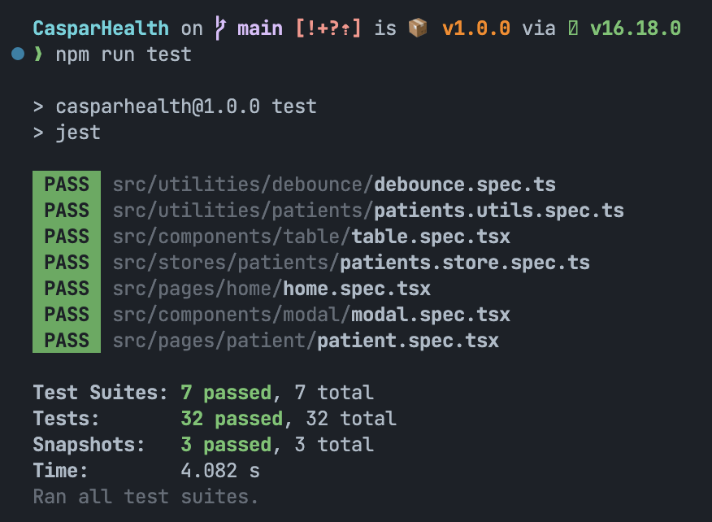

Total time spent on the project: `9h 40m`

## TOC

1. [How to run the project](#How-to-run-the-project)
2. [How to run unit tests](#🧪-Running-unit-tests)
3. [Objectives](#Objectives)
4. [My Stack of choice](#My-Stack-of-choice)
5. [Design Decisions](#Design-Decisions)

## How to run the project

1. Install dependencies
   - `pnpm install`
2. Run project in dev mode
   - `npm run start`

### 🧪 Running unit tests

`npm run test`



### Objective:

> Create a patient search tool. It should have 2 pages: a list page and a detail’s page. The list page should have a search form and a list while the detail’s page should have the patient's details.

```
❌ Uncompleted Tasks

✅ Completed Tasks ( Checked for completion )
```
- 👉 **Pages**
---
  - <span style="color: cyan; font-size: 20px"> List Page </span>
    1. ✅  A search form that takes in a query and returns a patients’ list. A patient can be searched by name, ID or email (use the data in the attached JSON file)
    2. ✅ It should have two filters: a sex filter (male and female) and an age filter(“18 - 30”, “31 - 45” and “ > 45”)
    3. ✅ An alphabetical sorting option

    >Note that the search data should persist, that is the data should not be lost, even when you switch components or routes.

    **Scenario**

    - ✅ A user visits the list page and sees a list of patients along with a search form that comprises:
    a search query input, a filter (with sex and age) and an alphabetical sorting tool.
    - ✅ A user starts searching by typing a query inside the search input field.
    - ✅ When the user stops typing, that is, after a 500 milliseconds delay, the query is used to search the data
    - ✅ If a result is found, the data it returns should render a list of patient
    - ✅ If there is no result, the user should see an error message
    - ✅ If the user deletes every single search query from the input field, it should return the entire users in the list
    - ✅ When the user selects the age filter, it should return the search result that contains only the selected age range
    - ✅ When the user selects the sex filter, It should return the search result that contains only the selected sex
    - ✅ When the user selects the age filter and the sex filter, it should return the search result that contains only the selected sex and selected age range.

    **List Functionality**
    - ✅ List should only show the Patient ID and Full name
    - ✅ A route to the Patient's detail page

    **Scenario**
    - ✅ A user visits the app main page, the user should see a list of Patients.
    - ✅ Each list item should have the patient's Full name and patient's ID
    - ✅ When the user clicks on a Patient on the list The user is directed to the patient's detail page
----
  - <span style="color: cyan; font-size: 20px"> Details Page </span>

- Go back Functionality
  - ✅ A go back button

- Scenario
  - ✅ A user visits the Patient's details page
  - ✅ When the user clicks the go back button, the user is directed back to the list page. The search result, filter and sort data should persist.
- Delete Functionality
    - ✅ A delete button to trigger delete confirmation modal
    - ✅ A delete confirmation modal with a confirm delete and a cancel button
- Scenario
    - ✅ A user visits the Patient's details page, the user should see the complete patient data.
    - ✅ And it should have a delete button.
    - ✅ When the user clicks on the delete button, a modal should pop up with a confirmation text:
    "Are you sure you want to delete `${userID}`"?
    - ✅ When the user clicks on the confirm Delete button, the Patient is deleted
    - ✅ And the user is directed back to the main page with the same search result, filter and sort data that were there previously without the deleted Patient.

## My Stack of choice

- Typescript
- Webpack
- Babel
- React
- Styled-Components
- Zustand

## 🔨 Design Decisions

### 🔶 Why not Axios ( Or similar HTTP libraries )

I strongly believe in 99.99% percent of projects you don't need such things to handle your HTTP request. such as I did in this project you can simply wrap the fetch in a function and customize it as much as you want. I implement this method in both [Legamart](https://legamart.com) and [Postpace](https://postpace.io) and both working perfectly.

### 🔶 Why Zustand

1. **Simplicity**: Zustand provides a simple and straightforward API based on React hooks, making it easy to learn and use, especially for developers already familiar with React hooks.
2. **Lightweight**: Zustand is a small library with a minimal overhead, which can result in better performance compared to larger state management solutions like Redux.
3. **Easy Integration**: Since Zustand is built around hooks, it seamlessly integrates with React components without requiring extra dependencies or boilerplate code.
4. **No Boilerplate**: Zustand reduces the need for boilerplate code, as it allows you to define your state and update functions with minimal setup.
5. **Centralized State**: Like Redux, Zustand also offers centralized state management, which can help to keep your application's state organized and manageable.
6. **Performance**: Zustand is designed to be lightweight and efficient. It does not introduce unnecessary abstractions or middleware layers, which can result in better overall performance compared to more complex state management solutions like Redux.
7. **Immutability**: Zustand leverages Immer under the hood, which allows you to directly mutate the state in a mutable manner. However, Immer ensures that these mutations are made in an immutable way behind the scenes. This makes it easier to work with state updates and helps prevent accidental state mutations.
8. **TypeScript Support**: Zustand has excellent TypeScript support out of the box. Its API is well-typed, which can help catch type-related errors during development and improve code quality.
9. **Support for React Concurrent Mode**: Zustand is designed to work well with React Concurrent Mode (a.k.a. React Suspense). This allows us to take advantage of React's concurrent rendering capabilities without additional adjustments.
10. **Small Bundle Size**: Due to its simplicity and focused feature set, Zustand contributes to smaller bundle sizes, which is essential for optimizing application performance.
